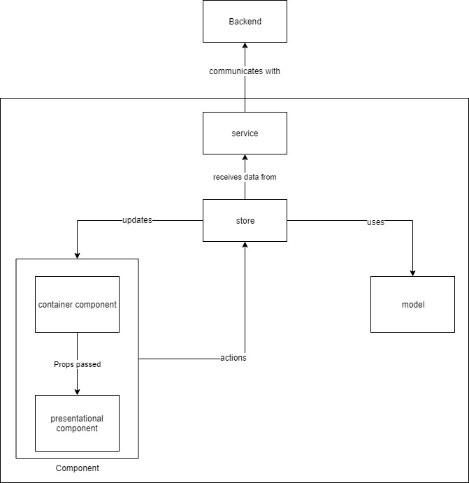

# Avalon: The Resistance - Online Couch Game

The React.js implementation of the card rpg Avalon: The Resistance.

Play at [avalon.s0rensen.no](avalon.s0rensen.no)

## Authors

* **Marius Sørensen** - [sorensenmarius](https://github.com/sorensenmarius) - [s0rensen.no](www.s0rensen.no)
* **Simon Degen** - [SimonDegen](https://github.com/SimonDegen) - [degen.no](www.degen.no)

## Getting Started
This game is built with [AspNet Boilerplate](https://aspnetboilerplate.com/)
### Installing

After cloning repository, first install npm packages:

```sh
cd reactjs
npm install 
```

And then start

```
npm start
```

## Deployment

```sh
npm build
```

## Built With

* [React](https://reactjs.org/) - The JavaScript library for building user interfaces
* [Typescript](https://www.typescriptlang.org/) - Used for static typing
* [Mobx](https://mobx.js.org/) - Simple, scalable state management
* [AntDesign](https://ant.design/) - A design system with values of Nature and Determinacy for better user experience of enterprise applications

# Architecture

This game is designed by utilizing MVC design pattern and layered architecture as follows:

- All Backend communications are done by service layer.
- For every Container Component there exists one Store and one Model.
- Store has state of application so it consumes service See "Defining data stores". All service functions will be called in store not in Component. Component executes Store actions when state is needed.
- Presentational Component can use store directly by injecting the store or Props from Container Component can be passed in it.
- Container or Presentational Component can invoke store actions and automatic rendering of component will be done by Mobx.



## Authors of ASP.NET Boilerplate ReactJS Template

* **Rashiduddin Yoldash** - *Initial work* - [ryoldash](https://github.com/ryoldash)
* **Mehmet Yasir Aktunç** - *Initial work* - [mhmtyasr](https://github.com/mhmtyasr)
* **Samet Kabay** - *Initial work* - [smtkby](https://github.com/smtkby)
